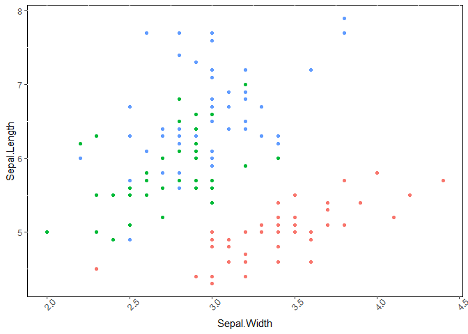

<!-- README.md is generated from README.Rmd. Please edit that file -->

# ggdollar

The goal of ggdollar is to provide a more intuitive way to set `theme()`
arguments when using the package *ggplot2*.

`theme()` is a complex function, we provide nested lists of functions
that should guide the users to what they through a sequence of limited
choices thanks to autocomplete.

It’s a draft, but works ok already.

## Installation

``` r
remotes::install_github("moodymudskipper/ggdollar")
```

## Intro

`ggset`, `ggdo` and `ggremove` are nested lists of functions.

`ggset` lets you dig to the element you want to change, and apply those
changes, so that `ggset$panel$background(fill = "blue")` is the same as
`theme(panel.background = element_rect(fill = "blue"))`. The arguments
are most of the time ultimately forwarded to an `element_*()` function
and you can change many attributes of a component at once. `?margin`
will provide the description of most parameters.

`ggdo` on the other hands starts from the action you want to perform,
For instance the equivalent to the above would be
`ggdo$fill_background$panel("red")`. Typically with `ggdo` we set only a
single or a couple of attributes at once.

`ggremove` is like `ggset` but helps removing components, it sets the
relevant `theme()` arguments to `element_blank()`, `NULL` or `"none"`.

For instance `ggremove$panel$background()` is the same as
`theme(panel.background = element_blank())`

There would have been many other ways to organize these lists and we
went for an partially arbitrary reorganization rather than a fully
systematic one.

``` r
library(ggdollar)
library(ggplot2) 
ggplot(iris, aes(Sepal.Width, Sepal.Length, color = Species)) + geom_point() + 
  ggset$panel$background(fill = "white", color = "black") + # top down approach to change theme
  ggdo$set_text$angle$axis$x$bottom$text(45) + # bottom up approach
  ggremove$legend$all() # removing element
```



## To do :

  - find better names
  - support in `ggdo` attributes that aren’t related to `element_*()`
    functions
  - Play around and see what doesn’t feel right
  - better doc
  - cleaner code
  - display native *ggplot2* code
